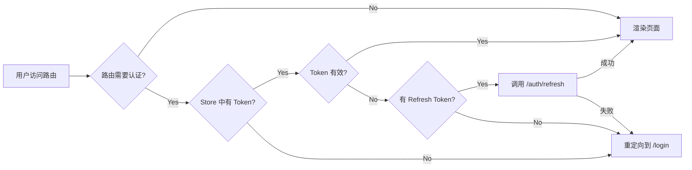
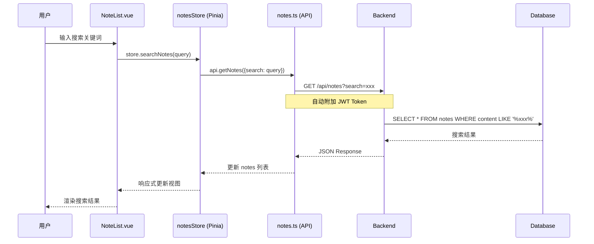
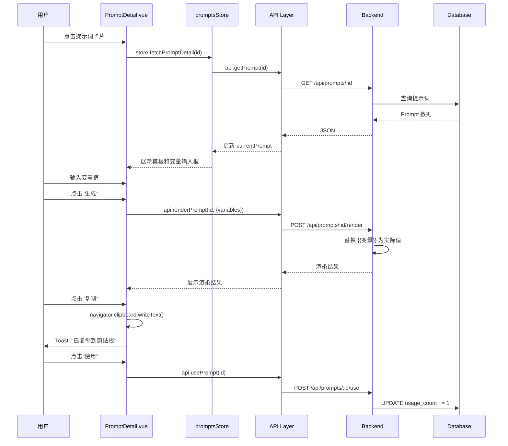
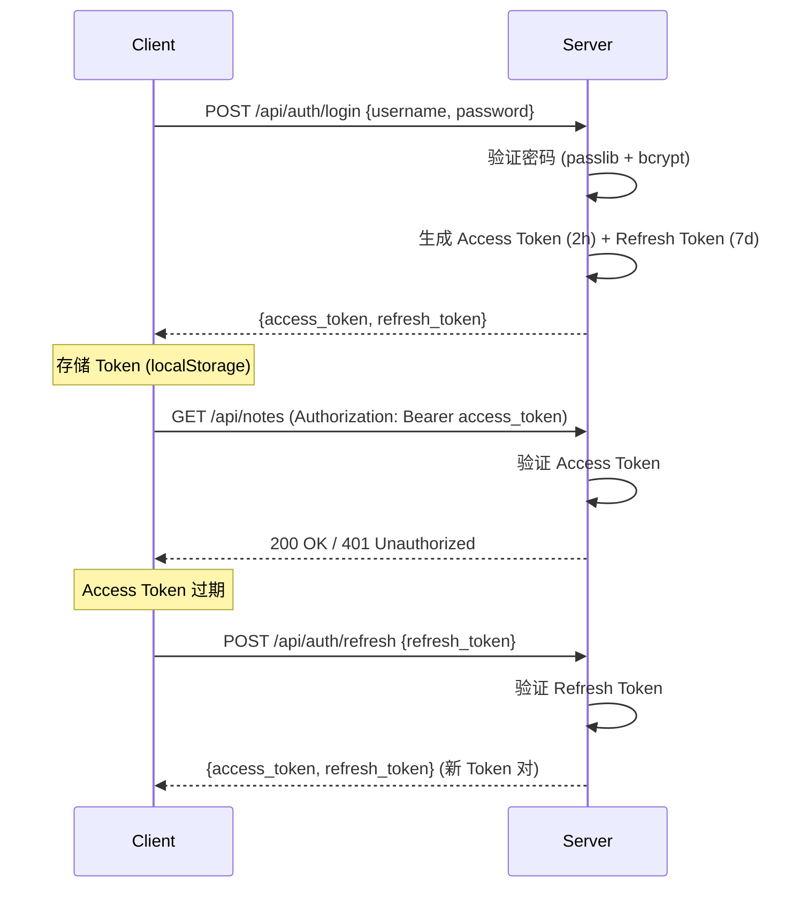
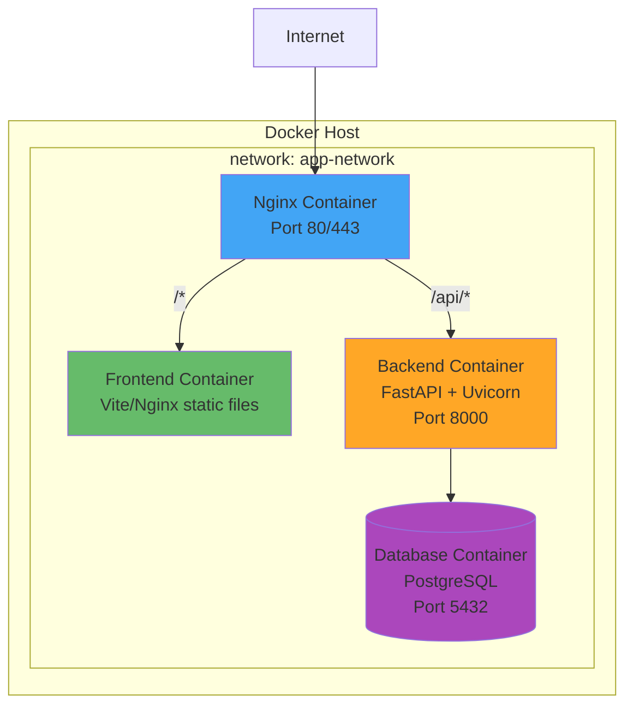

# 🏗 ResourceHub 系统架构文档

> **版本：** v0.1.0  
> **最后更新：** 2026-07-01  
> **前置文档：** [项目开发文档.md](项目开发文档.md)

---

## 目录

1. [系统架构总览](#1-系统架构总览)
2. [前端架构](#2-前端架构)
3. [后端架构](#3-后端架构)
4. [数据流设计](#4-数据流设计)
5. [技术选型决策记录](#5-技术选型决策记录)
6. [安全设计](#6-安全设计)
7. [部署架构](#7-部署架构)

---

## 1. 系统架构总览

### 1.1 分层架构图

```mermaid
graph TB
    subgraph "📱 客户端层"
        B[Browser SPA<br/>Vue 3 + TypeScript]
    end
    
    subgraph "🌐 网关层"
        N[Nginx<br/>静态资源代理 + API 反向代理]
    end
    
    subgraph "⚙️ 服务层"
        API[FastAPI Application]
        subgraph "内部模块"
            R[Routers<br/>路由分发]
            S[Services<br/>业务逻辑]
            M[Models<br/>数据模型]
            SC[Schemas<br/>请求/响应校验]
        end
    end
    
    subgraph "🗄️ 数据层"
        DB[(SQLite / PostgreSQL)]
        C[Cache Layer<br/>(future)]
    end
    
    B --> N
    N --> API
    API --> DB
    R --> S
    S --> M
    SC --> R
```

### 1.2 请求生命周期

```
┌─────────┐    ① HTTP Request      ┌──────────┐    ② Auth Check    ┌──────────┐
│  Browser │ ────────────────────▶ │  Nginx   │ ────────────────▶ │  FastAPI  │
│  (Vue)   │                        │ (反向代理) │                    │  (Router) │
└─────────┘                        └──────────┘                    └─────┬────┘
      ▲                                                                  │
      │                                                                  │
      │                                                                  ▼
      │                                                          ┌──────────────┐
      │                        ⑧ HTTP Response                  │   Services   │
      │ ◀────────────────────────────────────────────────────── │  (业务逻辑)    │
      │                                                          └──────┬───────┘
      │                                                                 │
      │                                                                 ▼
      │                                                          ┌──────────────┐
      │                                                          │  SQLAlchemy  │
      │                                                          │    (ORM)     │
      │                                                          └──────┬───────┘
      │                                                                 │
      │                                                                 ▼
      │                                                          ┌──────────────┐
      │                                                          │   Database   │
      └───────────────────────────────────────────────────────── │  (SQLite/PG) │
                                                                  └──────────────┘
```

---

## 2. 前端架构

### 2.1 架构设计模式

前端采用 **组合式 API + 单向数据流** 模式：

```
User Action → Component Event → Pinia Action → API Call → Update State → Reactive UI
```

### 2.2 目录职责

```
frontend/src/
├── api/                  # 网络层：封装 axios 实例 + 各模块 API 调用
│   ├── http.ts           #   → axios 实例创建、请求/响应拦截器、Token 自动附加
│   ├── auth.ts           #   → 认证相关 API
│   ├── notes.ts          #   → 笔记相关 API
│   ├── prompts.ts        #   → 提示词相关 API
│   └── categories.ts     #   → 分类相关 API
│
├── stores/               # 状态层：Pinia Store
│   ├── auth.ts           #   → 用户认证状态（Token、用户信息）
│   ├── notes.ts          #   → 笔记列表、当前笔记、搜索状态
│   ├── prompts.ts        #   → 提示词列表、当前提示词、筛选状态
│   └── categories.ts     #   → 分类树结构、当前选中分类
│
├── router/               # 路由层
│   └── index.ts          #   → 路由配置、懒加载、导航守卫（Auth Check）
│
├── views/                # 视图层：页面级组件
│   ├── Login.vue         #   → 登录/注册表单
│   ├── Dashboard.vue     #   → 仪表盘统计页
│   ├── Notes/            #   → 笔记模块页面
│   │   ├── NoteList.vue      #   笔记列表页（含分类树 + 搜索）
│   │   ├── NoteDetail.vue    #   笔记详情页
│   │   └── NoteEditor.vue    #   笔记编辑器页
│   └── Prompts/          #   → 提示词模块页面
│       ├── PromptList.vue      #   提示词网格列表
│       ├── PromptDetail.vue    #   提示词详情（弹窗）
│       └── PromptEditor.vue    #   提示词编辑
│
├── components/           # 组件层：可复用公共组件
│   ├── NavBar.vue        #   → 顶部导航栏
│   ├── SideBar.vue       #   → 侧边栏（分类树导航）
│   ├── CategoryTree.vue  #   → 递归分类树组件
│   └── MarkdownPreview.vue # → Markdown 渲染组件
│
└── utils/                # 工具层
    ├── format.ts         #   → 日期、文本格式化
    └── clipboard.ts      #   → 剪贴板操作封装
```

### 2.3 状态管理设计

```typescript
// stores/auth.ts — 认证状态
interface AuthState {
  user: User | null;
  accessToken: string | null;
  refreshToken: string | null;
  isAuthenticated: boolean;
}

// stores/notes.ts — 笔记状态
interface NotesState {
  notes: Note[];
  currentNote: Note | null;
  total: number;
  page: number;
  searchQuery: string;
  selectedCategoryId: number | null;
  loading: boolean;
}

// stores/prompts.ts — 提示词状态
interface PromptsState {
  prompts: Prompt[];
  currentPrompt: Prompt | null;
  total: number;
  page: number;
  selectedCategoryId: number | null;
  showFavoritesOnly: boolean;
}

// stores/categories.ts — 分类状态
interface CategoriesState {
  noteCategories: Category[];
  promptCategories: Category[];
  loading: boolean;
}
```

### 2.4 路由守卫流程



---

## 3. 后端架构

### 3.1 分层架构

```
Request → Middleware → Router → Schema Validation → Service → ORM → Database
```

### 3.2 各层职责

| 层       | 目录            | 职责                                               |
| -------- | --------------- | -------------------------------------------------- |
| Routers  | `app/routers/`  | 路由分发、HTTP 请求处理、参数提取、调用 Service    |
| Services | `app/services/` | 业务逻辑编排、事务管理、跨模型操作                  |
| Models   | `app/models/`   | SQLAlchemy 声明式映射、表关系定义                   |
| Schemas  | `app/schemas/`  | Pydantic 请求/响应模型、数据校验、序列化            |
| Core     | `app/core/`     | 配置管理、数据库引擎、安全工具、依赖注入            |

### 3.3 依赖注入设计

采用 FastAPI 的 `Depends` 实现依赖注入，核心依赖链：

```python
# app/core/deps.py

async def get_db() -> AsyncSession:
    """数据库会话依赖"""
    async with SessionLocal() as session:
        yield session

async def get_current_user(
    token: str = Depends(oauth2_scheme),
    db: AsyncSession = Depends(get_db)
) -> User:
    """JWT Token → 当前用户"""
    payload = decode_access_token(token)
    user = await db.get(User, payload.sub)
    if not user:
        raise HTTPException(status_code=401)
    return user
```

### 3.4 目录到 API 映射

```
app/routers/auth.py        →  /api/auth/*
app/routers/notes.py       →  /api/notes/*
app/routers/prompts.py     →  /api/prompts/*
app/routers/categories.py  →  /api/categories/*
```

---

## 4. 数据流设计

### 4.1 笔记模块数据流



### 4.2 提示词渲染数据流



---

## 5. 技术选型决策记录

### ADR-001: FastAPI 作为后端框架

- **背景**：后端需要支持 RESTful API，在 Gin (Go) 和 FastAPI (Python) 间选择
- **决策**：选择 FastAPI
- **理由**：
  - 自动生成 Swagger/OpenAPI 文档，开发体验好
  - Pydantic 集成实现请求/响应校验，减少样板代码
  - 异步支持，适合 IO 密集型场景
  - 对个人项目而言，Python 开发迭代速度更快
- **代价**：运行时性能不如 Go，但个人工具场景下可忽略
- **结论**：接受

### ADR-002: Pinia 替代 Vuex

- **背景**：Vue 3 状态管理选型
- **决策**：选择 Pinia
- **理由**：Vue 3 官方推荐、TypeScript 类型推断更好、API 更简洁、无 Mutation 概念
- **结论**：接受

### ADR-003: Element Plus 作为 UI 框架

- **背景**：管理后台 UI 框架选型
- **决策**：选择 Element Plus
- **理由**：
  - 与 Vue 3 同步发布，版本对齐
  - 设计风格适合内容管理型应用
  - 组件丰富（Tree、Table、Form 等）
- **结论**：接受

### ADR-004: SQLite 起步，PostgreSQL 生产

- **背景**：数据库选型
- **决策**：开发环境使用 SQLite，生产迁移到 PostgreSQL
- **理由**：零配置起步，SQLAlchemy 的 ORM 抽象使得切换成本低
- **代价**：部分 SQLite 特有功能（如 FTS5）在生产需要替代方案
- **结论**：接受，但 ORM 层避免使用 SQLite 特有语法

### ADR-005: 双 Token JWT 机制

- **背景**：认证方案设计
- **决策**：Access Token (2h) + Refresh Token (7d)
- **理由**：短时效 Access Token 降低泄露风险；Refresh Token 提供良好用户体验
- **结论**：接受

---

## 6. 安全设计

### 6.1 认证流程



### 6.2 安全措施清单

| 措施                     | 实现方式                             |
| ------------------------ | ------------------------------------ |
| 密码存储                 | bcrypt 哈希（passlib）               |
| JWT 签名                 | HS256 算法，密钥从环境变量读取        |
| API 鉴权                 | FastAPI Depends 中间件注入            |
| CORS                     | 白名单模式，仅允许前端域名            |
| 输入校验                 | Pydantic 模型自动校验                 |
| SQL 注入防护             | SQLAlchemy ORM 参数化查询             |
| XSS 防护                 | Vue 默认转义 + Content-Security-Policy|
| 速率限制                 | 登录接口可加 slowapi（MVP 后）        |

---

## 7. 部署架构

### 7.1 Docker 部署架构



### 7.2 docker-compose.yml 结构

```yaml
version: '3.8'
services:
  frontend:
    build: ./frontend
    ports:
      - "80:80"
    depends_on:
      - backend
      
  backend:
    build: ./backend
    environment:
      - DATABASE_URL=postgresql+asyncpg://user:pass@db:5432/resourcehub
      - SECRET_KEY=${SECRET_KEY}
    depends_on:
      - db
      
  db:
    image: postgres:16-alpine
    volumes:
      - pgdata:/var/lib/postgresql/data
    environment:
      - POSTGRES_DB=resourcehub
      - POSTGRES_USER=user
      - POSTGRES_PASSWORD=pass

volumes:
  pgdata:
```

---

> **本文档主要面向：** 开发者 / 架构师  
> **配套文档：** [项目开发文档.md](项目开发文档.md) · [docs/API接口文档.md](docs/API接口文档.md) · [docs/数据库设计.md](docs/数据库设计.md)
