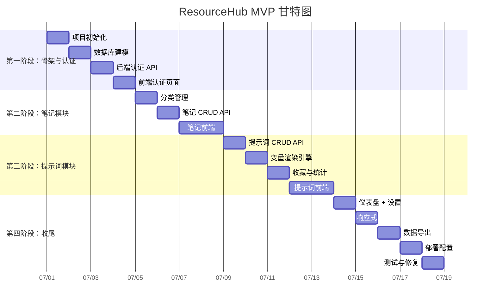
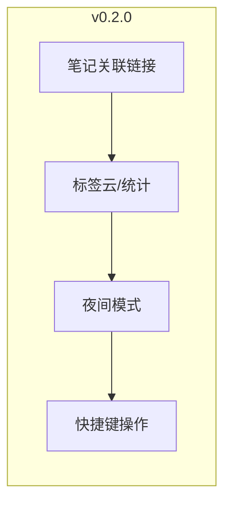

# 🗺 ResourceHub 开发计划与路线图

> **版本：** v0.1.0  
> **状态：** MVP 阶段  
> **最后更新：** 2026-07-01

---

## 目录

1. [总体时间线](#1-总体时间线)
2. [第一阶段：项目骨架与认证系统](#2-第一阶段项目骨架与认证系统)
3. [第二阶段：笔记模块](#3-第二阶段笔记模块)
4. [第三阶段：提示词模块](#4-第三阶段提示词模块)
5. [第四阶段：UI 美化与收尾](#5-第四阶段-ui-美化与收尾)
6. [后续迭代路线图](#6-后续迭代路线图)
7. [开发规范与检查清单](#7-开发规范与检查清单)

---

## 1. 总体时间线



### 各阶段里程碑

| 阶段 | 预计耗时 | 里程碑                                 |
| :--: | :------ | :------------------------------------- |
|  1   | 3-4 天  | ✅ 用户可以注册登录，看到空的仪表盘      |
|  2   | 3-4 天  | ✅ 用户可以完整管理笔记和分类            |
|  3   | 3-4 天  | ✅ 用户可以完整管理提示词和模板渲染      |
|  4   | 2-3 天  | ✅ MVP 可部署运行，体验完整              |

---

## 2. 第一阶段：项目骨架与认证系统

**目标：** 搭建前后端项目骨架，实现用户认证全流程。

### 2.1 任务拆解

#### Day 1: 项目初始化

| 序号 | 任务                        | 技术要点                     | 产出文件                              |
| ---: | --------------------------- | ---------------------------- | ------------------------------------- |
| 1.1  | 初始化前端 Vite + Vue 3 项目 | `npm create vite@latest`     | `frontend/package.json`, `vite.config.ts` |
| 1.2  | 安装前端依赖                | pinia, vue-router, axios, element-plus, markdown-it | `frontend/package.json`   |
| 1.3  | 初始化后端 FastAPI 项目      | `uvicorn main:app`           | `backend/main.py`, `requirements.txt` |
| 1.4  | 配后端配置文件              | pydantic-settings 环境变量管理 | `backend/app/core/config.py`         |
| 1.5  | 配前端 Vite 代理            | proxy 到 `localhost:8000`    | `vite.config.ts`                      |
| 1.6  | 后端项目骨架                | 创建目录结构、`__init__.py`  | routers, models, schemas, services    |

**验证：** 前后端分别启动，前端页面正常显示，后端 `GET /docs` 可以打开 Swagger。

#### Day 2: 数据库建模

| 序号 | 任务                        | 技术要点                     | 产出文件                              |
| ---: | --------------------------- | ---------------------------- | ------------------------------------- |
| 2.1  | 配置 SQLAlchemy 引擎         | AsyncSession, Base           | `backend/app/core/database.py`        |
| 2.2  | 实现 User 模型               | SQLAlchemy 模型定义          | `backend/app/models/user.py`          |
| 2.3  | 实现 Category 模型           | 自引用 parent_id             | `backend/app/models/category.py`      |
| 2.4  | 实现 Note 模型               | FK → User, Category         | `backend/app/models/note.py`          |
| 2.5  | 实现 Prompt 模型             | FK → User, Category         | `backend/app/models/prompt.py`        |
| 2.6  | 配置 Alembic 迁移            | `alembic init` + 自动生成迁移 | `alembic/versions/`                   |

**验证：** `alembic upgrade head` 执行成功，SQLite 数据库中创建了 4 张表。

#### Day 3: 后端认证 API

| 序号 | 任务                        | 技术要点                     | 产出文件                              |
| ---: | --------------------------- | ---------------------------- | ------------------------------------- |
| 3.1  | 实现密码加密工具             | passlib + bcrypt             | `backend/app/core/security.py`        |
| 3.2  | 实现 JWT 工具               | PyJWT, 双 Token 机制         | `backend/app/core/security.py`        |
| 3.3  | 实现认证依赖注入             | `get_current_user`           | `backend/app/core/deps.py`            |
| 3.4  | 实现 Auth Pydantic Schemas  | 请求/响应模型                 | `backend/app/schemas/auth.py`         |
| 3.5  | 实现 User Service           | 注册、登录、刷新逻辑          | `backend/app/services/auth_service.py` |
| 3.6  | 实现 Auth Router            | register / login / refresh / me | `backend/app/routers/auth.py`       |

**验证：** 通过 Swagger 或 curl 测试注册、登录、刷新 Token、获取用户信息接口。

#### Day 4: 前端认证页面

| 序号 | 任务                        | 技术要点                     | 产出文件                              |
| ---: | --------------------------- | ---------------------------- | ------------------------------------- |
| 4.1  | 创建 axios 实例 + 拦截器     | 自动附加 Token, 401 处理     | `frontend/src/api/http.ts`            |
| 4.2  | 实现 auth API 封装           | 注册/登录/刷新/获取用户       | `frontend/src/api/auth.ts`            |
| 4.3  | 实现 auth Store              | Pinia, Token 持久化          | `frontend/src/stores/auth.ts`         |
| 4.4  | 配置路由 + 导航守卫          | 未登录重定向到 /login        | `frontend/src/router/index.ts`        |
| 4.5  | 实现登录/注册页面            | Element Plus 表单 + 校验     | `frontend/src/views/Login.vue`        |
| 4.6  | 实现顶部导航栏               | NavBar 组件                  | `frontend/src/components/NavBar.vue`  |
| 4.7  | 实现仪表盘占位页             | 统计卡片（硬编码数据）         | `frontend/src/views/Dashboard.vue`    |

**阶段验证清单：**
- [ ] `npm run dev` 和 `uvicorn main:app --reload` 都能正常启动
- [ ] 访问 `localhost:5173` 自动跳转到登录页
- [ ] 注册新用户成功
- [ ] 登录成功，跳转到仪表盘
- [ ] 刷新页面后仍然保持登录状态（Token 持久化）
- [ ] 登出后无法访问受保护页面
- [ ] Swagger 文档可访问 `localhost:8000/docs`

---

## 3. 第二阶段：笔记模块

**目标：** 实现笔记和分类的完整 CRUD，支持搜索。

### 3.1 后端 API

| 序号 | 任务                        | 时间 | 产出文件                              |
| ---: | --------------------------- | :-- | :------------------------------------ |
| 1    | Category CRUD API           | 1d  | `schemas/category.py`, `services/category_service.py`, `routers/categories.py` |
| 2    | Note CRUD API               | 1d  | `schemas/note.py`, `services/note_service.py`, `routers/notes.py` |
| 3    | 全文搜索实现                | 0.5d| `services/note_service.py` (新增 search 方法) |
| 4    | 前端 API 封装 + Store      | 0.5d| `api/notes.ts`, `stores/notes.ts`, `api/categories.ts`, `stores/categories.ts` |

### 3.2 前端页面

| 序号 | 任务                        | 时间 | 产出文件                              |
| ---: | --------------------------- | :-- | :------------------------------------ |
| 5    | 实现分类树组件               | 0.5d| `components/CategoryTree.vue`        |
| 6    | 笔记列表页                  | 1d  | `views/Notes/NoteList.vue`           |
| 7    | 笔记编辑器（Markdown）      | 1d  | `views/Notes/NoteEditor.vue`         |
| 8    | 笔记详情页                  | 0.5d| `views/Notes/NoteDetail.vue`         |

### 3.3 界面布局

```
┌──────────────────────────────────────────────────────┐
│  NavBar                                              │
├──────────┬───────────────────────────────────────────┤
│          │  [搜索框 🔍]    [+ 新建笔记]               │
│ 分类树    │  ┌─────────────────────────────────────┐  │
│          │  │  笔记卡片 1 (标题/摘要/标签/时间)     │  │
│ 📁 技术   │  ├─────────────────────────────────────┤  │
│  ├─ 前端  │  │  笔记卡片 2                          │  │
│  ├─ 后端  │  ├─────────────────────────────────────┤  │
│ 📁 生活   │  │  笔记卡片 3                          │  │
│          │  └─────────────────────────────────────┘  │
│ 笔记: 12  │              [分页]                      │
└──────────┴───────────────────────────────────────────┘
```

**阶段验证清单：**
- [ ] 新增/编辑/删除分类，分类树正确渲染
- [ ] 创建笔记（Markdown 内容）保存成功
- [ ] 编辑笔记内容后保存成功
- [ ] 删除笔记成功
- [ ] 点击分类树，笔记列表正确筛选
- [ ] 搜索关键词，笔记列表实时筛选
- [ ] 置顶/取消置顶功能正常
- [ ] 笔记 Markdown 内容正确渲染

---

## 4. 第三阶段：提示词模块

**目标：** 实现提示词完整 CRUD、变量渲染引擎、收藏和使用统计。

### 4.1 后端 API

| 序号 | 任务                        | 时间 | 产出文件                              |
| ---: | --------------------------- | :-- | :------------------------------------ |
| 1    | Prompt CRUD API             | 1d  | `schemas/prompt.py`, `services/prompt_service.py`, `routers/prompts.py` |
| 2    | 变量渲染引擎                | 0.5d| `services/prompt_service.py` (render 方法) |
| 3    | 收藏 + 使用统计             | 0.5d| `services/prompt_service.py` (favorite + use_count) |

### 4.2 前端页面

| 序号 | 任务                        | 时间 | 产出文件                              |
| ---: | --------------------------- | :-- | :------------------------------------ |
| 4    | 前端 API 封装 + Store      | 0.5d| `api/prompts.ts`, `stores/prompts.ts` |
| 5    | 提示词卡片网格              | 0.5d| `views/Prompts/PromptList.vue`        |
| 6    | 提示词编辑                  | 0.5d| `views/Prompts/PromptEditor.vue`      |
| 7    | 提示词详情 + 变量渲染交互   | 1d  | `views/Prompts/PromptDetail.vue`      |

### 4.3 核心交互流程

```
┌───────────┐    ┌───────────┐    ┌───────────┐    ┌───────────┐
│  卡片网格   │───▶│  详情弹窗   │───▶│  变量输入   │───▶│  渲染结果   │
│  (浏览/筛选) │    │  (模板展示)  │    │  (填充变量)  │    │  (复制文本)  │
└───────────┘    └───────────┘    └───────────┘    └───────────┘
```

### 4.4 变量渲染引擎实现

变量渲染是提示词库的核心功能，采用简单的正则替换实现：

```python
import re

def render_prompt_template(template: str, variables: dict[str, str]) -> str:
    """
    将提示词模板中的 {{变量名}} 替换为实际值
    
    示例:
    template = "请用{{language}}编写一个{{topic}}的教程"
    variables = {"language": "Python", "topic": "FastAPI"}
    → "请用Python编写一个FastAPI的教程"
    """
    def replace_var(match):
        var_name = match.group(1).strip()
        return variables.get(var_name, match.group(0))
    
    return re.sub(r'\{\{(\w+)\}\}', replace_var, template)
```

**变量提取辅助函数：**
```python
def extract_variables(template: str) -> list[str]:
    """从模板中提取所有变量名"""
    return re.findall(r'\{\{(\w+)\}\}', template)
```

**阶段验证清单：**
- [ ] 新增/编辑/删除提示词
- [ ] 提示词模板中的 `{{变量}}` 被正确识别
- [ ] 输入变量值后，提示词渲染结果正确
- [ ] 一键复制提示词到剪贴板
- [ ] 收藏/取消收藏功能正常
- [ ] 使用次数每次调用 +1
- [ ] 按分类筛选和收藏筛选正常

---

## 5. 第四阶段：UI 美化与收尾

**目标：** 完善用户体验，适配移动端，支持数据导出，配置部署。

### 5.1 任务拆解

| 序号 | 任务                        | 时间 | 说明                                |
| ---: | --------------------------- | :-- | :---------------------------------- |
| 1    | 仪表盘页面                  | 0.5d| 统计卡片（笔记数/提示词数/使用最多） |
| 2    | 设置页面                    | 0.5d| 个人信息展示、数据导出入口           |
| 3    | 数据导出功能                | 0.5d| JSON/Markdown 导出                   |
| 4    | 响应式移动端适配            | 0.5d| Element Plus 响应式 + 媒体查询      |
| 5    | 夜间模式（可选）            | 0.5d| CSS 变量 + 切换按钮                 |
| 6    | Docker 部署配置             | 0.5d| Dockerfile + docker-compose.yml      |
| 7    | 整体测试与 Bug 修复         | 0.5d| 边界情况、错误处理                  |
| 8    | 项目文档完善                | 0.5d| README 截图、使用说明               |

### 5.2 数据导出 API

```json
// GET /api/export/notes?format=json
// GET /api/export/notes?format=markdown
// GET /api/export/prompts?format=json

// 响应: JSON 文件或 Markdown 文件下载
Content-Type: application/json / text/markdown
Content-Disposition: attachment; filename="notes-export-2026-07-01.json"
```

### 5.3 响应式断点

| 断点        | 宽度       | 布局变化                         |
| ----------- | ---------- | -------------------------------- |
| PC          | ≥ 1200px   | 三栏布局：侧边栏 + 列表 + 内容   |
| 平板        | 768-1199px | 两栏：侧边栏折叠 + 列表/内容切换 |
| 手机        | < 768px    | 单栏：全屏切换，底部导航          |

### 5.4 部署流程

```bash
# 1. 构建前端
cd frontend && npm run build

# 2. 构建后端镜像
cd backend && docker build -t resourcehub-api .

# 3. 启动所有服务
docker-compose up -d

# 4. 初始化数据库
docker-compose exec backend alembic upgrade head

# 访问 http://localhost:80
```

**阶段验证清单：**
- [ ] 仪表盘正确显示统计数据
- [ ] 数据导出 JSON 格式正确
- [ ] 数据导出 Markdown 格式正确
- [ ] 手机屏幕下布局正常，交互可用
- [ ] Docker 构建成功，启动后前后端联通
- [ ] 无控制台报错（Vue/Nginx 层面）

---

## 6. 后续迭代路线图

### v0.2.0 — 体验增强



| 功能         | 优先级 | 预计工时 | 说明                            |
| ------------ | ------ | -------- | ------------------------------- |
| 笔记关联链接  | ★★     | 2d       | `[[笔记标题]]` 语法，双向链接   |
| 标签云/统计   | ★       | 1d       | 统计各标签使用频率的可视化       |
| 夜间模式      | ★       | 1d       | CSS 变量 + 切换按钮 + 持久化    |
| 快捷键操作    | ★       | 1d       | `Ctrl+S` 保存、`Ctrl+K` 搜索等  |

### v0.3.0 — 扩展与集成

| 功能             | 优先级 | 预计工时 | 说明                            |
| ---------------- | ------ | -------- | ------------------------------- |
| 浏览器剪藏扩展    | ★★★    | 5d       | Chrome 扩展，一键保存网页为笔记  |
| 数据导入          | ★★     | 2d       | 支持 Markdown/Notion/语雀导入   |
| 提示词分享        | ★       | 2d       | 生成分享链接，公开或限时         |

### v0.4.0 — 协作与企业功能

| 功能          | 优先级 | 预计工时 | 说明                               |
| ------------- | ------ | -------- | ---------------------------------- |
| OAuth 第三方登录 | ★★   | 2d       | GitHub / Google 登录               |
| 团队空间       | ★★     | 5d       | 共享笔记和提示词库                  |
| API Token      | ★       | 1d       | 生成个人 API Token 用于第三方集成    |
| Webhook        | ★       | 3d       | 笔记变更通知、自动备份到 GitHub     |

---

## 7. 开发规范与检查清单

### 7.1 代码规范

| 规范           | 说明                                         |
| -------------- | -------------------------------------------- |
| 前端命名       | 组件 PascalCase，文件 camelCase               |
| 后端命名       | Python 函数/变量 snake_case，类 PascalCase    |
| API 路径       | 全小写 + 中划线 `/api/notes/pinned`          |
| Git 提交信息   | `feat:` / `fix:` / `refactor:` / `docs:` 前缀 |
| 分支策略       | `main` → `dev` → `feature/<name>`            |

### 7.2 测试策略（v0.2.0+）

| 层      | 工具             | 覆盖范围              |
| ------- | ---------------- | --------------------- |
| 后端    | pytest + httpx   | API 接口测试          |
| 前端    | Vitest           | Store + Utils 单元测试 |
| E2E     | Playwright       | 核心用户流程          |

### 7.3 发布检查清单

- [ ] 所有接口经过自测
- [ ] 前端构建无报错
- [ ] 数据库迁移脚本可执行
- [ ] 移动端布局检查通过
- [ ] Docker 构建通过
- [ ] README 截图更新
- [ ] 版本号更新

---

> **文档维护者：** ResourceHub Team  
> **最后更新：** 2026-07-01  
> **相关文档：** [项目开发文档.md](../项目开发文档.md) · [ARCHITECTURE.md](../ARCHITECTURE.md)
