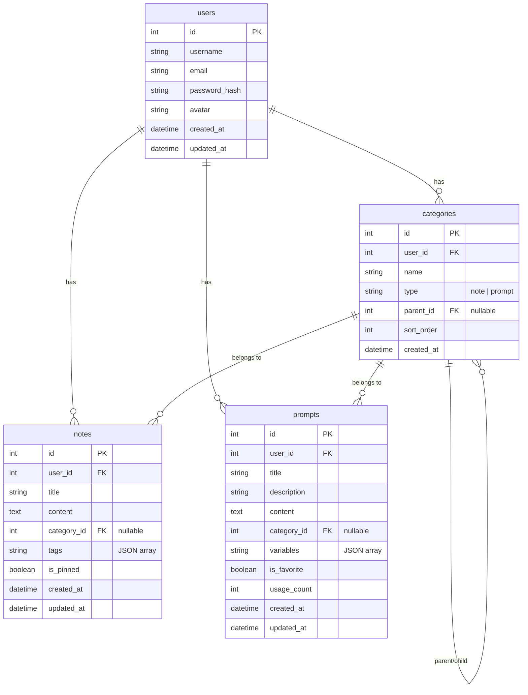
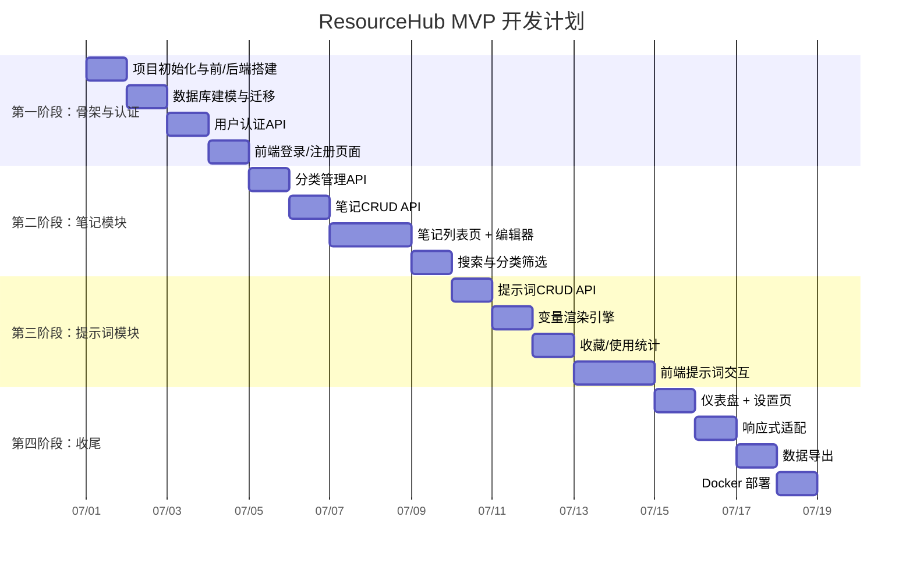

# 📚 ResourceHub 项目开发文档

> **版本：** v0.1.0 (MVP)  
> **状态：** 项目规划阶段  
> **最后更新：** 2026-07-01

---

## 目录

1. [项目概述](#1-项目概述)
2. [功能需求](#2-功能需求)
3. [技术架构](#3-技术架构)
4. [数据库设计](#4-数据库设计)
5. [API 接口设计](#5-api-接口设计)
6. [前端页面规划](#6-前端页面规划)
7. [项目目录结构](#7-项目目录结构)
8. [开发计划](#8-开发计划)

---

## 1. 项目概述

### 1.1 项目简介

**ResourceHub（资源整合中心）** 是一款面向开发者、AI 使用者和知识工作者的 **个人知识管理与 AI 提示词管理一体化工具**。它解决的核心痛点是：现有工具要么只做笔记管理、要么只做提示词管理，缺少一个将两者有机整合的解决方案。

### 1.2 核心功能矩阵

```
┌────────────────────────────────────────────────┐
│                ResourceHub                      │
├────────────────────┬───────────────────────────┤
│   📝 笔记模块      │   🤖 AI 提示词库           │
│                    │                           │
│  • CRUD 操作       │  • CRUD 操作              │
│  • 多级分类/标签   │  • 场景分类               │
│  • 全文搜索        │  • {{变量}} 模板语法       │
│  • Markdown 编辑   │  • 一键复制               │
│  • 笔记关联        │  • 快速填充/渲染           │
│  • 置顶功能        │  • 收藏/评分/使用统计      │
├────────────────────┴───────────────────────────┤
│          🔐 通用功能：认证 · 导出 · 响应式       │
└────────────────────────────────────────────────┘
```

### 1.3 目标用户

| 用户角色     | 典型需求                                     |
| ------------ | -------------------------------------------- |
| 开发者       | 记录技术笔记、管理常用代码/架构提示词         |
| AI 使用者    | 积累和分类在不同场景下的优质提示词模板        |
| 知识工作者   | 建立个人知识库，快速检索和复用信息            |

---

## 2. 功能需求

### 2.1 笔记模块

| 功能           | 优先级 | 说明                                     |
| -------------- | ------ | ---------------------------------------- |
| 笔记 CRUD      | P0     | 创建、编辑、删除、查看笔记                |
| 分类标签       | P0     | 支持多级分类和标签体系                    |
| 全文搜索       | P0     | 按标题/内容搜索                         |
| Markdown 编辑  | P0     | Markdown 编辑器 + 实时预览                |
| 笔记置顶       | P1     | 重要笔记可置顶在列表顶部                  |
| 笔记关联       | P2     | 笔记之间可建立双向关联链接（MVP 后迭代） |

### 2.2 AI 提示词库模块

| 功能           | 优先级 | 说明                                     |
| -------------- | ------ | ---------------------------------------- |
| 提示词 CRUD    | P0     | 创建、编辑、删除、查看提示词模板          |
| 分类管理       | P0     | 按场景分类（编程、写作、翻译、数据分析等）|
| 变量占位符     | P0     | `{{变量名}}` 模板语法                    |
| 一键复制       | P0     | 点击即可复制到剪贴板                      |
| 快速填充       | P1     | 输入变量值后生成最终可用版本              |
| 收藏/置顶      | P1     | 标记常用提示词，收藏列表优先展示          |
| 使用统计       | P2     | 记录每条提示词的被使用次数                |

### 2.3 通用功能

| 功能       | 优先级 | 说明                              |
| ---------- | ------ | --------------------------------- |
| 用户认证   | P0     | JWT Token 登录/注册               |
| 数据导出   | P1     | 笔记和提示词支持 JSON/Markdown 导出 |
| 响应式布局 | P1     | 适配 PC 和移动端                   |

### 2.4 用户交互流程

#### 提示词库核心交互

```
┌──────────────┐    ┌──────────────┐    ┌──────────────┐
│  提示词卡片   │───▶│  详情弹窗    │───▶│  变量输入区   │
│ (标题/分类/   │    │ (模板/描述/   │    │ (输入 {{变量}} │
│  收藏/使用次数)│    │  变量列表)    │    │  的值)        │
└──────────────┘    └──────────────┘    └───────┬───────┘
                                                 │
                        ┌──────────────┐◄────────┘
                        │  渲染结果区   │
                        │ (复制最终文本) │
                        └──────────────┘
```

---

## 3. 技术架构

### 3.1 总体架构

```
┌──────────────────────────────────────────────────────────────┐
│                        用户层 (Browser)                       │
├──────────────────────────────────────────────────────────────┤
│                    Vue 3 SPA (Vite)                          │
│  ┌──────────┐ ┌──────────┐ ┌──────────┐ ┌────────────────┐ │
│  │  路由层   │ │  视图层   │ │  状态层   │ │   网络层       │ │
│  │ vue-router│ │ *.vue    │ │  Pinia   │ │ axios + 拦截器 │ │
│  └──────────┘ └──────────┘ └──────────┘ └───────┬────────┘ │
├──────────────────────────────────────────────────┼───────────┤
│                    HTTP (JWT in Authorization)    │           │
├──────────────────────────────────────────────────┼───────────┤
│                   FastAPI Backend                │           │
│  ┌──────────┐ ┌──────────┐ ┌──────────┐ ┌───────┴────────┐ │
│  │  Routers  │ │ Services │ │  Schemas │ │    Core        │ │
│  │ (路由层)  │ │ (业务层)  │ │ (校验层) │ │  config/db/sec │ │
│  └─────┬────┘ └─────┬────┘ └─────┬────┘ └────────────────┘ │
│        └────────────┼────────────┘                          │
│               ┌─────┴─────┐                                 │
│               │ SQLAlchemy │                                 │
│               └─────┬─────┘                                 │
├─────────────────────┼───────────────────────────────────────┤
│               ┌─────┴─────┐                                 │
│               │  Database  │                                 │
│               │ SQLite/PG  │                                 │
│               └───────────┘                                 │
└──────────────────────────────────────────────────────────────┘
```

### 3.2 技术选型详解

#### 前端

| 技术            | 版本   | 用途               | 选型理由                         |
| --------------- | ------ | ------------------ | -------------------------------- |
| Vue 3           | 3.4+   | 框架核心           | Composition API + TS 支持优秀    |
| TypeScript      | 5.x    | 类型安全           | 降低运行时错误                    |
| Vite            | 5.x    | 构建工具           | 极速 HMR，开箱即用                |
| Pinia           | 2.x    | 状态管理           | Vue 3 官方推荐，TS 友好           |
| Vue Router      | 4.x    | 路由管理           | 官方路由，支持懒加载              |
| Element Plus    | 2.x    | UI 组件库          | 管理后台风格，组件丰富            |
| Axios           | 1.x    | HTTP 客户端        | 拦截器机制便于统一处理 Token      |
| Markdown-it     | 14.x   | Markdown 渲染      | 轻量快速，插件生态丰富            |

#### 后端

| 技术         | 版本     | 用途           | 选型理由                        |
| ------------ | -------- | -------------- | ------------------------------- |
| FastAPI      | 0.110+   | Web 框架       | 自动生成文档，异步支持            |
| SQLAlchemy   | 2.0+     | ORM            | 异步支持，类型提示完善            |
| Alembic      | 1.13+    | 数据库迁移     | SQLAlchemy 官方迁移工具          |
| Pydantic     | 2.x      | 数据校验       | FastAPI 内置，性能大幅提升       |
| PyJWT        | 2.x      | JWT 认证       | 成熟稳定的 JWT 库                |
| passlib      | 1.7+     | 密码加密       | bcrypt 算法，安全可靠            |
| python-multipart | -    | 文件上传       | FastAPI 文件上传支持             |

### 3.3 安全设计

1. **密码存储**：使用 `passlib` + `bcrypt` 进行密码哈希，不存储明文
2. **JWT 认证**：Access Token（2h 过期）+ Refresh Token（7d 过期）双 Token 机制
3. **API 鉴权**：除 `/api/auth/*` 外，所有 API 需携带 `Authorization: Bearer <token>`
4. **CORS**：前端开发模式下只允许 `localhost:5173` 跨域
5. **输入校验**：Pydantic 模型对所有输入进行类型校验和清洗

---

## 4. 数据库设计

### 4.1 ER 图



### 4.2 表结构

#### users（用户表）

| 字段            | 类型         | 约束                  | 说明            |
| --------------- | ------------ | --------------------- | --------------- |
| id              | INTEGER      | PK, AUTOINCREMENT     | 用户 ID         |
| username        | VARCHAR(50)  | UNIQUE, NOT NULL      | 用户名           |
| email           | VARCHAR(100) | UNIQUE                | 邮箱             |
| password_hash   | VARCHAR(255) | NOT NULL              | bcrypt 哈希密码 |
| avatar          | VARCHAR(255) |                       | 头像 URL        |
| created_at      | TIMESTAMP    | DEFAULT NOW           | 创建时间         |
| updated_at      | TIMESTAMP    | DEFAULT NOW           | 更新时间         |

#### categories（分类表）

| 字段       | 类型         | 约束                  | 说明                       |
| ---------- | ------------ | --------------------- | -------------------------- |
| id         | INTEGER      | PK, AUTOINCREMENT     | 分类 ID                    |
| user_id    | INTEGER      | FK -> users.id        | 所属用户                   |
| name       | VARCHAR(100) | NOT NULL              | 分类名称                   |
| type       | VARCHAR(20)  | NOT NULL              | 分类类型: 'note' / 'prompt'|
| parent_id  | INTEGER      | FK -> categories.id   | 父分类 ID（支持多级）       |
| sort_order | INTEGER      | DEFAULT 0             | 排序序号                   |
| created_at | TIMESTAMP    | DEFAULT NOW           | 创建时间                   |

#### notes（笔记表）

| 字段        | 类型         | 约束                  | 说明                        |
| ----------- | ------------ | --------------------- | --------------------------- |
| id          | INTEGER      | PK, AUTOINCREMENT     | 笔记 ID                     |
| user_id     | INTEGER      | FK -> users.id        | 所属用户                    |
| title       | VARCHAR(255) | NOT NULL              | 笔记标题                    |
| content     | TEXT         |                       | Markdown 内容               |
| category_id | INTEGER      | FK -> categories.id   | 所属分类                    |
| tags        | VARCHAR(500) |                       | JSON 数组: `["tag1","tag2"]`|
| is_pinned   | BOOLEAN      | DEFAULT FALSE         | 是否置顶                    |
| created_at  | TIMESTAMP    | DEFAULT NOW           | 创建时间                    |
| updated_at  | TIMESTAMP    | DEFAULT NOW           | 更新时间                    |

#### prompts（提示词表）

| 字段         | 类型         | 约束                  | 说明                          |
| ------------ | ------------ | --------------------- | ----------------------------- |
| id           | INTEGER      | PK, AUTOINCREMENT     | 提示词 ID                     |
| user_id      | INTEGER      | FK -> users.id        | 所属用户                      |
| title        | VARCHAR(255) | NOT NULL              | 提示词标题                    |
| description  | VARCHAR(500) |                       | 简短描述                      |
| content      | TEXT         | NOT NULL              | 提示词模板内容 `{{变量}}`      |
| category_id  | INTEGER      | FK -> categories.id   | 所属分类                      |
| variables    | VARCHAR(500) |                       | JSON 数组: `["name","lang"]`  |
| is_favorite  | BOOLEAN      | DEFAULT FALSE         | 是否收藏                      |
| usage_count  | INTEGER      | DEFAULT 0             | 使用次数                      |
| created_at   | TIMESTAMP    | DEFAULT NOW           | 创建时间                      |
| updated_at   | TIMESTAMP    | DEFAULT NOW           | 更新时间                      |

### 4.3 索引设计

```sql
-- 笔记表：加速按用户查询和搜索
CREATE INDEX idx_notes_user_id ON notes(user_id);
CREATE INDEX idx_notes_category_id ON notes(category_id);
CREATE INDEX idx_notes_created_at ON notes(created_at DESC);

-- 全文搜索（SQLite FTS5 可选）
-- CREATE VIRTUAL TABLE notes_fts USING fts5(title, content, content=notes);

-- 提示词表
CREATE INDEX idx_prompts_user_id ON prompts(user_id);
CREATE INDEX idx_prompts_category_id ON prompts(category_id);
CREATE INDEX idx_prompts_favorite ON prompts(user_id, is_favorite);

-- 分类表
CREATE INDEX idx_categories_user_type ON categories(user_id, type);
CREATE INDEX idx_categories_parent ON categories(parent_id);
```

> 完整数据库设计详见 [docs/数据库设计.md](docs/数据库设计.md)

---

## 5. API 接口设计

### 5.1 认证模块 `/api/auth`

| 方法   | 路径               | 请求体                          | 响应                          | 状态码  |
| ------ | ------------------ | ------------------------------- | ----------------------------- | ------- |
| POST   | `/api/auth/register` | `{username, password, email?}` | `{id, username, email, created_at}` | 201 |
| POST   | `/api/auth/login`    | `{username, password}`         | `{access_token, refresh_token}` | 200  |
| POST   | `/api/auth/refresh`  | `{refresh_token}`              | `{access_token, refresh_token}` | 200  |
| GET    | `/api/auth/me`       | — (Header: Bearer Token)       | `{id, username, email, avatar, created_at}` | 200 |

### 5.2 笔记模块 `/api/notes`

| 方法   | 路径                   | 说明                           |
| ------ | ---------------------- | ------------------------------ |
| GET    | `/api/notes`           | 笔记列表（分页、搜索、分类筛选）|
| GET    | `/api/notes/:id`       | 笔记详情                       |
| POST   | `/api/notes`           | 创建笔记                       |
| PUT    | `/api/notes/:id`       | 更新笔记                       |
| DELETE | `/api/notes/:id`       | 删除笔记                       |
| PUT    | `/api/notes/:id/pin`   | 置顶/取消置顶                   |

**GET /api/notes 查询参数：**

| 参数      | 类型    | 说明                               |
| --------- | ------- | ---------------------------------- |
| page      | int     | 页码，默认 1                       |
| page_size | int     | 每页数量，默认 20                   |
| search    | string  | 搜索关键词（匹配标题和内容）         |
| category_id | int   | 按分类筛选                         |
| tag       | string  | 按标签筛选                         |
| is_pinned | boolean | 只显示置顶笔记                     |

### 5.3 提示词模块 `/api/prompts`

| 方法   | 路径                       | 说明                             |
| ------ | -------------------------- | -------------------------------- |
| GET    | `/api/prompts`             | 提示词列表（分页、分类筛选）       |
| GET    | `/api/prompts/:id`         | 提示词详情                       |
| POST   | `/api/prompts`              | 创建提示词                       |
| PUT    | `/api/prompts/:id`         | 更新提示词                       |
| DELETE | `/api/prompts/:id`         | 删除提示词                       |
| POST   | `/api/prompts/:id/render`  | 传入变量值，渲染最终提示词         |
| POST   | `/api/prompts/:id/use`     | 记录使用次数+1                    |
| PUT    | `/api/prompts/:id/favorite` | 收藏/取消收藏                     |

**POST /api/prompts/:id/render 请求体：**

```json
{
  "variables": {
    "name": "Python",
    "language": "Chinese",
    "level": "beginner"
  }
}
```

**响应：**

```json
{
  "id": 1,
  "title": "代码教学提示词",
  "original_content": "请用{{language}}为{{name}}初学者编写一个{{level}}教程",
  "rendered_content": "请用Chinese为Python初学者编写一个beginner教程",
  "variables": {"name": "Python", "language": "Chinese", "level": "beginner"}
}
```

### 5.4 分类模块 `/api/categories`

| 方法   | 路径                   | 说明                           |
| ------ | ---------------------- | ------------------------------ |
| GET    | `/api/categories`      | 获取分类树（需传 ?type=note/prompt）|
| POST   | `/api/categories`      | 创建分类                       |
| PUT    | `/api/categories/:id`  | 更新分类                       |
| DELETE | `/api/categories/:id`  | 删除分类                       |

> 完整 API 文档详见 [docs/API接口文档.md](docs/API接口文档.md)

---

## 6. 前端页面规划

### 6.1 路由设计

| 路径              | 页面         | 说明                         | 权限   |
| ----------------- | ------------ | ---------------------------- | ------ |
| `/login`          | 登录页       | 简洁登录/注册表单             | 公开   |
| `/dashboard`      | 仪表盘       | 统计卡片（笔记数/提示词数等） | 需认证 |
| `/notes`          | 笔记列表     | 左侧分类树 + 中间列表 + 编辑器 | 需认证 |
| `/notes/:id`      | 笔记编辑     | Markdown 实时预览             | 需认证 |
| `/prompts`        | 提示词库     | 卡片网格展示 + 分类筛选       | 需认证 |
| `/prompts/:id`    | 提示词详情   | 模板展示 + 变量输入 + 渲染结果 | 需认证 |
| `/settings`       | 设置页       | 个人信息、数据导出             | 需认证 |

### 6.2 布局框架

```
┌───────────────────────────────────────────────────┐
│                    NavBar                          │
│  Logo  [仪表盘] [笔记] [提示词] [设置]   [头像▼]   │
├────────┬──────────────────────────────────────────┤
│        │                                          │
│ 侧边栏  │          Main Content                    │
│ (分类树) │                                          │
│         │     ┌──────────────────────┐             │
│ 笔记: 20 │     │                      │             │
│ ├ 技术   │     │   内容区域            │             │
│ ├ 生活   │     │                      │             │
│ └ 学习   │     │                      │             │
│         │     └──────────────────────┘             │
│ 提示词: │                                          │
│ ├ 编程   │                                          │
│ ├ 写作   │                                          │
│ └ 翻译   │                                          │
│         │                                          │
└─────────┴──────────────────────────────────────────┘
```

### 6.3 组件树

```
App.vue
├── NavBar.vue                    # 顶部导航栏
├── SideBar.vue                   # 侧边栏（分类树 + 统计）
├── Login.vue                     # 登录/注册页
├── Dashboard.vue                 # 仪表盘
│   ├── StatCard.vue              # 统计卡片
│   └── RecentList.vue            # 最近使用列表
├── Notes/
│   ├── NoteList.vue              # 笔记列表
│   ├── NoteCard.vue              # 笔记卡片
│   ├── NoteEditor.vue            # 笔记编辑器（Markdown）
│   └── CategoryTree.vue          # 分类树组件
└── Prompts/
    ├── PromptGrid.vue            # 提示词网格
    ├── PromptCard.vue            # 提示词卡片
    ├── PromptDetail.vue          # 提示词详情弹窗
    ├── VariableInput.vue         # 变量输入区
    └── RenderedResult.vue        # 渲染结果区
```

---

## 7. 项目目录结构

```
resource-hub/
│
├── frontend/                          # 🌐 Vue 3 前端
│   ├── src/
│   │   ├── api/
│   │   │   ├── auth.ts                # 认证 API
│   │   │   ├── notes.ts               # 笔记 API
│   │   │   ├── prompts.ts             # 提示词 API
│   │   │   ├── categories.ts          # 分类 API
│   │   │   └── http.ts                # axios 实例（拦截器）
│   │   ├── components/
│   │   │   ├── NavBar.vue             # 顶部导航栏
│   │   │   ├── SideBar.vue            # 侧边栏
│   │   │   ├── CategoryTree.vue       # 分类树
│   │   │   └── MarkdownPreview.vue    # Markdown 预览
│   │   ├── views/
│   │   │   ├── Login.vue
│   │   │   ├── Dashboard.vue
│   │   │   ├── Notes/
│   │   │   │   ├── NoteList.vue
│   │   │   │   ├── NoteDetail.vue
│   │   │   │   └── NoteEditor.vue
│   │   │   └── Prompts/
│   │   │       ├── PromptList.vue
│   │   │       ├── PromptDetail.vue
│   │   │       └── PromptEditor.vue
│   │   ├── stores/
│   │   │   ├── auth.ts                # 认证状态
│   │   │   ├── notes.ts               # 笔记状态
│   │   │   ├── prompts.ts             # 提示词状态
│   │   │   └── categories.ts          # 分类状态
│   │   ├── router/
│   │   │   └── index.ts               # 路由配置 + 导航守卫
│   │   ├── utils/
│   │   │   ├── format.ts              # 日期/文本格式化
│   │   │   └── clipboard.ts           # 剪贴板工具
│   │   ├── App.vue
│   │   ├── main.ts                    # 入口文件
│   │   └── style.css                  # 全局样式
│   ├── index.html
│   ├── package.json
│   ├── tsconfig.json
│   ├── vite.config.ts
│   └── env.d.ts
│
├── backend/                           # ⚙️ FastAPI 后端
│   ├── app/
│   │   ├── __init__.py
│   │   ├── main.py                    # FastAPI 应用入口
│   │   ├── core/
│   │   │   ├── __init__.py
│   │   │   ├── config.py              # 配置管理（环境变量）
│   │   │   ├── database.py            # 数据库连接 + Session
│   │   │   ├── security.py            # JWT 生成/验证、密码哈希
│   │   │   └── deps.py                # 依赖注入（get_current_user）
│   │   ├── models/
│   │   │   ├── __init__.py
│   │   │   ├── user.py                # User 模型
│   │   │   ├── note.py                # Note 模型
│   │   │   ├── prompt.py              # Prompt 模型
│   │   │   └── category.py            # Category 模型
│   │   ├── schemas/
│   │   │   ├── __init__.py
│   │   │   ├── auth.py                # 认证请求/响应 Pydantic 模型
│   │   │   ├── note.py                # 笔记 Pydantic 模型
│   │   │   ├── prompt.py              # 提示词 Pydantic 模型
│   │   │   └── category.py            # 分类 Pydantic 模型
│   │   ├── routers/
│   │   │   ├── __init__.py
│   │   │   ├── auth.py                # /api/auth/*
│   │   │   ├── notes.py               # /api/notes/*
│   │   │   ├── prompts.py             # /api/prompts/*
│   │   │   └── categories.py          # /api/categories/*
│   │   └── services/
│   │       ├── __init__.py
│   │       ├── auth_service.py        # 认证业务逻辑
│   │       ├── note_service.py        # 笔记业务逻辑
│   │       ├── prompt_service.py      # 提示词业务逻辑
│   │       └── category_service.py    # 分类业务逻辑
│   ├── alembic/                       # 数据库迁移
│   │   └── versions/
│   ├── alembic.ini
│   ├── requirements.txt
│   └── Dockerfile
│
├── docs/                              # 📖 项目文档
│   ├── 数据库设计.md
│   ├── API接口文档.md
│   └── 开发计划与路线图.md
│
├── docker-compose.yml                 # 🐳 Docker 部署
├── .gitignore
├── 项目开发文档.md                    # 本文档
├── ARCHITECTURE.md                    # 架构说明
└── README.md                          # 项目介绍
```

---

## 8. 开发计划

### 8.1 MVP 分阶段路线图



### 8.2 各阶段里程碑

#### 🏁 第一阶段结束目标（第 3-4 天结束）

```
✅ 项目骨架搭建完成
✅ 数据库 4 张表创建成功
✅ 注册/登录/刷新 Token 接口可用
✅ 前端可以登录并跳转到空白的 /dashboard
```

#### 🏁 第二阶段结束目标（第 6-8 天结束）

```
✅ 笔记 CRUD 全流程可用
✅ 分类创建和管理可用
✅ 全文搜索可用
✅ 分类树 + 笔记列表 + 编辑器的 UI 交互完成
```

#### 🏁 第三阶段结束目标（第 9-12 天结束）

```
✅ 提示词 CRUD 全流程可用
✅ 变量模板渲染正确
✅ 一键复制可用
✅ 卡片网格 + 详情弹窗 + 变量填充交互完成
```

#### 🏁 第四阶段结束目标（第 14 天结束）

```
✅ 仪表盘显示统计数据
✅ 移动端布局适配基本可用
✅ JSON / Markdown 导出功能可用
✅ Docker 启动后前后端正常联通
```

### 8.3 技术债务 & 后续规划

| 项目                   | 优先级 | 计划版本 |
| ---------------------- | ------ | -------- |
| 笔记间关联链接          | 低     | v0.2.0   |
| 标签云 / 统计图表       | 低     | v0.2.0   |
| 浏览器剪藏扩展          | 中     | v0.3.0   |
| Notion/语雀数据导入     | 低     | v0.3.0   |
| OAuth 第三方登录        | 中     | v0.4.0   |
| 夜间模式                | 低     | v0.2.0   |
| 单元测试 & CI           | 中     | v0.2.0   |

---

> **文档维护者：** ResourceHub Team  
> **最后更新：** 2026-07-01  
> **配套文档：** [ARCHITECTURE.md](ARCHITECTURE.md) · [README.md](README.md) · [docs/API接口文档.md](docs/API接口文档.md)
